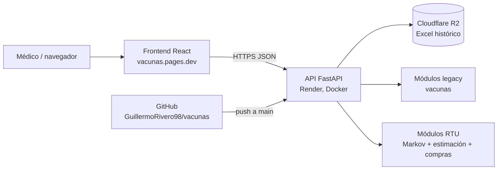
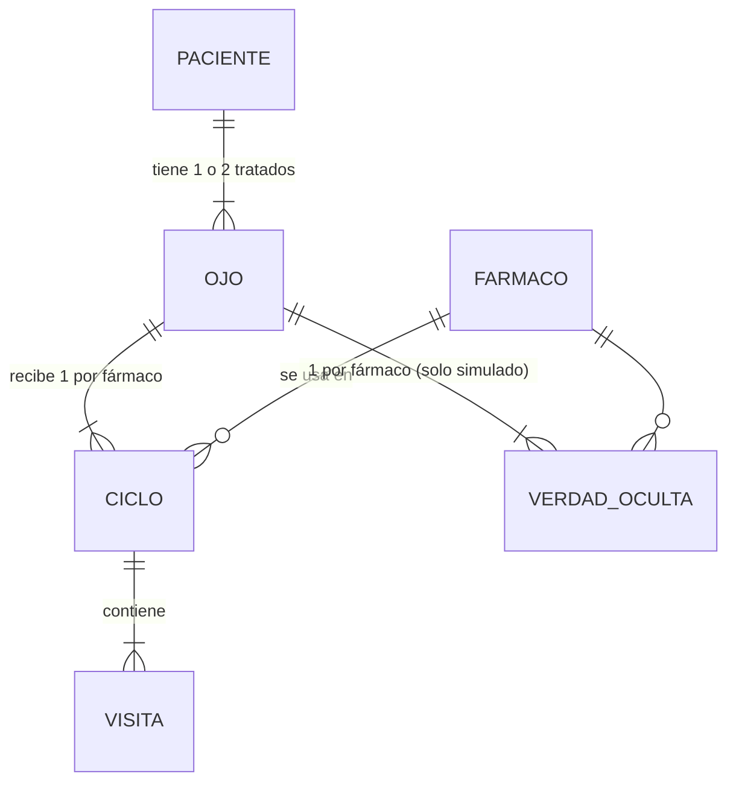

# Sistema de apoyo a la decisión para tratamiento intravítreo (RTU)

> **Este documento es la fuente de verdad del proyecto.** Antes de asumir cualquier cosa sobre el sistema —en una sesión propia o con un asistente de IA— se consulta acá. Si algo no está en este documento, no se da por hecho: se verifica y se agrega.

Última actualización: 2026-09-24

---

## 0. Cómo usar este documento

### 0.1 Convenciones de estado

| Marca | Significado |
|---|---|
| **[HECHO]** | Implementado y verificado con evidencia (salida de ejecución, prueba contra el deploy). La evidencia está en la sección 12. |
| **[EN CURSO]** | Empezado, no terminado. |
| **[PENDIENTE]** | Definido, no empezado. |
| **[PROPUESTA]** | Diseño sugerido, todavía no aprobado. Puede cambiar. |
| **[SUPUESTO]** | Valor o regla elegida sin validación clínica ni datos reales. |
| **[A CONFIRMAR]** | Dato que no se conoce con certeza. **Nunca tratarlo como hecho.** |

### 0.2 Reglas para trabajar con asistentes de IA

1. Pasarle este README al inicio de cada sesión.
2. Ningún plazo, fecha de entrega o compromiso existe salvo que figure en la sección 15. (Antecedente: en una sesión anterior un asistente inventó una "demo de mañana" que no existía.)
3. Ninguna cifra de resultados se reporta si no está en la sección 12 o no se obtuvo corriendo el código.
4. Al terminar una sesión, actualizar la sección 17 (registro de cambios) y el estado de las tareas de la sección 13.
5. Distinguir siempre entre el servicio y repo actual (`vacunas`) y el anterior (`api-vacunas`). Ver sección 5.4.

---

## 1. Propósito y alcance

### 1.1 Qué es

Un sistema de **apoyo a la decisión clínica** para unidades de terapia retinal (RTU) que tratan con inyecciones intravítreas de fármacos anti-VEGF bajo el protocolo *treat-and-extend* (T&E). Dado un paciente, estima para cada fármaco candidato:

- cuántas inyecciones, visitas y semanas de tratamiento son esperables;
- la probabilidad de terminar en estabilidad, en cambio de fármaco (switch) o en abandono;

y le **recomienda al médico los fármacos con más chances de funcionar para ese paciente, mostrando en qué casos históricos parecidos se basa el cálculo**. Además sugiere en qué orden probarlos si hay que hacer switch.

### 1.2 Qué NO es

- No toma decisiones clínicas. La decisión final es siempre del médico tratante.
- No interpreta imágenes (OCT, retinografías). Eso queda como trabajo futuro.
- No usa un modelo de lenguaje para calcular nada (ver principio P1).
- **No está validado con datos reales ni por un clínico.** Hoy funciona sobre datos simulados y supuestos documentados.

### 1.3 Origen del proyecto

El sistema empezó como un "optimizador de orden de vacunación" (esquema *legacy*, sección 9.4). Se reencuadró al dominio de terapia intravítrea a partir de una presentación de una RTU de un hospital chileno y del software que usan (RetinApp), vistos en 22 fotografías. Las técnicas sugeridas por quien propuso el trabajo (grafo bayesiano, red neuronal, *machine learning*, leyes de probabilidad, cadenas de Markov) fueron **sugerencias, no requisitos**. Los requisitos explícitos fueron: incluir **cadenas de Markov** y usar **Cloudflare**.

> **Privacidad:** varias de esas fotografías muestran el nombre, RUT y edad de una paciente real en el encabezado de RetinApp. No se usan en el repo, el informe ni la presentación sin recortar o difuminar esa zona.

---

## 2. Glosario

| Término | Significado |
|---|---|
| RTU | *Retinal Therapy Unit*, unidad de inyecciones intraoculares. |
| Anti-VEGF | Familia de fármacos intravítreos (en las imágenes aparecen Avastin y Vabysmo/Faricimab). En el sistema se usan nombres genéricos: FarmacoA/B/C. |
| T&E | *Treat-and-extend*: si el ojo está seco se inyecta y se extiende el intervalo; si está activo, se inyecta y se acorta. |
| Fase de carga | Dosis iniciales a intervalo fijo antes del T&E. |
| Switch | Cambio de fármaco por falta de respuesta. |
| Línea | Posición del fármaco en la secuencia del ojo (1 = primer fármaco; 2+ = después de un switch). |
| Ciclo | Tramo del tratamiento de un ojo con un mismo fármaco, desde su carga hasta estable, switch, abandono o censura. |
| AV | Agudeza visual (decimal). |
| CMT | Grosor macular central, en µm (medido por OCT). |
| IRF / SRF | Líquido intrarretiniano / subretiniano (hallazgos de OCT que indican actividad). |
| OCT | Tomografía de coherencia óptica. |
| DMRE | Degeneración macular relacionada a la edad (exudativa). |
| EMD | Edema macular diabético. |
| OVCR / ORVR | Oclusión de vena central / de rama venosa retiniana. |
| MNV1/2/3 | Tipos de membrana neovascular (solo DMRE). |
| Verdad oculta | Parámetros reales con los que el generador simula a cada paciente. Solo existen en datos simulados. |
| Legacy | El esquema anterior de "vacunas" (sección 9.4). |

---

## 3. Principios de diseño (no negociables)

| Id | Principio | Consecuencia práctica |
|---|---|---|
| P1 | **Todo cálculo es determinístico y auditable.** Un LLM nunca calcula ni decide. | Mismo input → mismo output. Semillas fijas en todo lo aleatorio. Si alguna vez se agrega un LLM, solo narra un resultado ya calculado, sin inventar cifras, sin lenguaje causal clínico, mencionando limitaciones y aclarando que la decisión es del médico. |
| P2 | **La decisión final es del médico.** | Toda salida dirigida a usuarios lo aclara. |
| P3 | **Los supuestos del protocolo viven en un solo lugar** (`supuestos_protocolo.py`). | Generador y motor de Markov usan la misma regla. Cambiar un supuesto es cambiar un valor. |
| P4 | **La verdad oculta nunca la lee un estimador.** | Vive en un archivo aparte y solo la usan los scripts de evaluación. |
| P5 | **Partición train/test por paciente**, nunca por fila. | Los dos ojos y todas las visitas de un paciente quedan del mismo lado. |
| P6 | **Separar modelo de estimación.** | El motor de Markov recibe `p_activo(estado)` ya armada; no estima nada. |
| P8 | **Solo probabilidad clásica.** Nada de aprendizaje automático ni IA (ADR-16). | Conteos con pandas, probabilidad condicional, regla de Bayes, esperanza, varianza, Teorema Central del Límite. Ninguna librería de *machine learning* en el sistema; un test lo verifica. |
| P7 | **Honestidad estadística.** | Se reportan incertidumbre, errores estándar y limitaciones. No se declara un ganador si las diferencias están dentro del ruido. |

---

## 4. Requerimientos

### 4.1 Funcionales

| Id | Requerimiento | Estado |
|---|---|---|
| RF-01 | Generar un histórico simulado por visita y por ojo con las variables de RetinApp. | [HECHO] |
| RF-02 | Exportar la verdad oculta por (paciente, ojo, fármaco), incluidos contrafácticos, en un archivo separado. | [HECHO] |
| RF-03 | Modelar el protocolo T&E como cadena de Markov absorbente y calcular visitas, inyecciones, semanas y probabilidades de absorción. | [HECHO] |
| RF-04 | Estimar `p_activo(estado, paciente, fármaco, línea)` con el Camino A (Beta). | **[DESACTIVADO]** comentado con `#` (ADR-16) |
| RF-05 | Estimar `p_activo` con el grafo probabilístico (red bayesiana), calculado con fórmulas clásicas sobre conteos de pandas. **Único método del sistema.** | [HECHO] |
| RF-06 | Si falta un dato del paciente, el Camino B marginaliza esa variable en vez de fallar. | [HECHO] |
| RF-07 | Recomendar fármacos y su orden. **Objetivo por defecto: maximizar P(estable)** (el fármaco con más chances de funcionar); alternativo: minimizar inyecciones esperadas. | [HECHO] |
| RF-08 | Recomendación consciente de línea (posición 1 con estimación de línea 1, siguientes con línea 2+). | [HECHO] |
| RF-09 | Testear la independencia entre fármacos (Cochran-Mantel-Haenszel). | [HECHO] |
| RF-10 | Evaluar estimadores y políticas contra la verdad oculta. | [HECHO] |
| RF-11 | Endpoint de API que devuelva la recomendación para un caso (`POST /rtu/sugerir-plan`). | [HECHO] en local; deploy pendiente (T5.9) |
| RF-12 | Endpoint protegido para cargar el histórico RTU en R2 y reentrenar (`POST /admin/rtu/actualizar-historico`). | [HECHO] en local; deploy pendiente (T5.9) |
| RF-13 | Validar el esquema del Excel RTU al subirlo y rechazar con mensaje claro si no cumple. | [HECHO] |
| RF-14 | Frontend: formulario del paciente, recomendación con explicación y pantalla de compra. | [HECHO] publicado en https://vacunas.pages.dev |
| RF-15 | Excluir fármacos ya probados y calcular la línea a partir de ellos. | [HECHO] |
| RF-16 | Reporte PDF del resultado RTU. | [PENDIENTE] Opcional |
| RF-17 | Personalizar `p_activo` con la historia observada del propio ojo. | [PENDIENTE] Fase 8, opcional |
| RF-18 | Resumen en lenguaje natural por LLM con reglas de *grounding* (P1). | [PENDIENTE] Opcional, sin decidir |
| RF-19 | **Explicación por casos similares:** junto con cada recomendación, mostrar en qué casos históricos se basa: cuántos casos parecidos hubo por fármaco, cómo les fue (estable / switch / abandono, inyecciones) y un listado de los N casos más parecidos con sus características y su evolución. | [HECHO] |
| RF-21 | **Estimación de compra:** demanda esperada, desvío y compra sugerida por fármaco en un horizonte, a un nivel de servicio dado, según el uso histórico de cada fármaco (`POST /rtu/estimacion-compra`). | [HECHO] en local |
| RF-22 | Calibrar la estimación de compra con backtests sobre el propio histórico y mostrar la calibración usada. | [HECHO] |
| RF-20 | Los casos mostrados al médico se identifican solo con IDs anónimos del histórico, nunca con datos personales. | [HECHO] (el histórico tampoco debe contener datos personales) |

### 4.2 No funcionales

| Id | Requerimiento | Criterio | Estado |
|---|---|---|---|
| RNF-01 | Reproducibilidad | Mismas entradas y semillas → mismos resultados en cualquier máquina. | [HECHO] Verificado Linux vs Windows, fases 1 a 4. |
| RNF-02 | Auditabilidad | Cada probabilidad del grafo es un cociente de conteos reproducible a mano; la compra informa su calibración y los backtests usados. | [HECHO] |
| RNF-03 | Configurabilidad del protocolo | Cambiar un supuesto clínico = cambiar un valor en `supuestos_protocolo.py`. | [HECHO] |
| RNF-04 | Latencia de `/rtu/sugerir-plan` con el modelo entrenado | < 2 s | [HECHO] Render: 0.71-0.72 s medido desde Montevideo (incluye red). `/rtu/estimacion-compra` con caché: instantáneo. |
| RNF-05 | Arranque en frío en Render | El entrenamiento no debe recaer en la consulta del médico. | [HECHO] Antes: 88.8 s en la primera consulta (entrenando desde Excel, con pgmpy). Ahora (CSV + grafo con fórmulas + precalentamiento por `/health`): modelo entrenado en menos de 7 s tras la carga; compra por defecto precalculada a los ~79 s, en segundo plano. Antes de usar el sistema, llamar a `/health` y esperar `rtu_modelo_entrenado: true`. |
| RNF-06 | Memoria | La imagen debe entrar en los recursos del plan de Render. El sistema RTU ya no carga pgmpy (solo lo usa el legacy). | [A CONFIRMAR] qué recurso son los 10 GB informados (ver Q-05) y consumo real de RAM |
| RNF-07 | Seguridad | Endpoints de administración con `X-API-Key`; secretos solo en variables de entorno; el Excel nunca queda público; la API solo acepta pedidos de navegador desde el frontend (`FRONTEND_ORIGINS`). | [HECHO] |
| RNF-08 | Privacidad | Sin datos de pacientes reales en el repo ni en R2 hasta tener autorización formal. | Vigente |
| RNF-09 | Compatibilidad | Python 3.12; versiones fijadas en `requirements.txt`. | [HECHO] |
| RNF-10 | Mantenibilidad | Módulos RTU aditivos, sin romper los endpoints legacy mientras convivan. | Vigente |
| RNF-11 | Tiempo de evaluación offline | Poder correr con pocas réplicas mientras se desarrolla. | [PENDIENTE] parámetro `--replicas` |

---

## 5. Arquitectura e infraestructura

### 5.1 Componentes



### 5.2 Servicios

| Servicio | Uso | Detalle conocido | Estado |
|---|---|---|---|
| GitHub | Repositorio del backend | `GuillermoRivero98/vacunas`, rama `main`. Cada push dispara el deploy en Render. | [HECHO] |
| Render | Hosting del backend | Docker, plan gratuito, `https://vacunas-mwyr.onrender.com`. Límite informado en el panel: 10 GB (ver Q-05). | [HECHO] |
| Cloudflare R2 | Almacenamiento del Excel histórico | Bucket por defecto `vacunas-historico`. Objetos: `historico_vacunas.xlsx` (legacy), `historico_rtu.xlsx` (RTU, original) e `historico_rtu.csv` (RTU, copia que lee el entrenamiento; se genera al subir). Acceso autenticado vía API S3 (boto3). | [HECHO] |
| Cloudflare Pages | Hosting del frontend | Proyecto `vacunas`, dominio **https://vacunas.pages.dev**. Conectado a GitHub: cada push a `main` publica solo. Build: carpeta raíz `frontend`, comando `npm run build`, salida `dist`. | [HECHO] |

### 5.3 Variables de entorno (Render → Environment)

| Variable | Uso | Requerida |
|---|---|---|
| `ADMIN_API_KEY` | Protege los endpoints de administración (header `X-API-Key`). Rotada el 2026-09-22 tras quedar expuesta en una conversación. | Sí |
| `R2_ACCOUNT_ID` | Cuenta de Cloudflare R2. | Sí |
| `R2_ACCESS_KEY_ID` | Access Key del token R2. | Sí |
| `R2_SECRET_ACCESS_KEY` | Secret Key del token R2. | Sí |
| `R2_BUCKET_NAME` | Bucket del Excel. | No (default `vacunas-historico`) |
| `FRONTEND_ORIGINS` | Restringe CORS a orígenes separados por coma. Configurado: `https://vacunas.pages.dev`. Las direcciones de deploys puntuales (`xxxx.vacunas.pages.dev`) quedan fuera a propósito. | No (default `*`) |
| `RTU_DATOS_SIMULADOS` | Si es `true`, la respuesta RTU advierte que los datos son simulados. Poner `false` recién con datos reales. | No (default `true`) |
| `RTU_PRECALENTAR` | Si es `true`, la primera llamada a `/health` (con histórico cargado y sin modelo) dispara el entrenamiento RTU en segundo plano. | No (default `true`) |
| `RTU_HISTORICO_LOCAL` | **Solo desarrollo:** ruta a un Excel RTU local en vez de R2. No configurarla en Render. | No |

### 5.4 Repos y servicios: cuál es cuál

| Nombre | Qué es | Estado |
|---|---|---|
| `GuillermoRivero98/vacunas` → `vacunas-mwyr.onrender.com` | **Repo y servicio actual.** Todo el desarrollo va acá. | Activo |
| `GuillermoRivero98/api-vacunas` → `api-vacunas.onrender.com` | **Primera versión, en desuso.** Se le portaron los fixes de R2 (commit `ec8e8a4`). No se desarrolla más ahí. | Obsoleto (ver T7.6) |
| Frontend | No existe todavía. Menciones anteriores a `api.ts`, `types.ts` o `ResultadoView.tsx` no corresponden a nada vigente. | [PENDIENTE] fase 6 |

---

## 6. Modelo del dominio y entidades

### 6.1 Diagrama entidad-relación (conceptual)



En los archivos Excel las entidades están **desnormalizadas** en una tabla plana (una fila por visita), por simplicidad y porque así lo consumen pandas y la API.

### 6.2 Entidades

| Entidad | Atributos | Notas |
|---|---|---|
| Paciente | `paciente_id`, `edad`, `diagnostico`, `diabetes`, `hipertension`, `acv_iam_reciente`, `tabaquismo`, `glaucoma`, `cristalino`, `tipo_mnv` | En el EMD, `diabetes` es siempre 1. `tipo_mnv` solo aplica a DMRE ("NA" en el resto). |
| Ojo | (`paciente_id`, `ojo`) con `ojo` ∈ {OD, OI} | Los dos ojos de un paciente no son independientes. |
| Fármaco | FarmacoA, FarmacoB, FarmacoC | Nombres genéricos a propósito: los efectos simulados son inventados. |
| Ciclo | Tramo de un ojo con un fármaco | Termina en `estable`, `switch`, `abandono` o `censurado`. |
| Visita | Ver sección 9.1 | Una fila por evaluación. En un switch hay dos filas en la misma semana: el cierre del fármaco viejo y la primera carga del nuevo. |
| EstadoCiclo | `fase`, `dosis_carga_previas`, `intervalo_semanas`, `activas_consecutivas_en_min`, `secas_consecutivas_en_max` | Estado markoviano; los contadores son necesarios para que la regla dependa solo del estado. |
| Decision | `accion`, `inyecta`, `siguiente`, `intervalo_hasta_proxima` | Salida de `transicion()`. |
| SupuestosProtocolo | Sección 8 | Inmutable (`frozen`). |
| ResultadoMarkov | `visitas_esperadas`, `inyecciones_esperadas`, `semanas_esperadas`, `prob_absorcion`, `visitas_por_estado` | Salida del motor para un fármaco. |
| Recomendacion | `por_farmaco`, `orden`, `valor_orden`, `objetivo` | Salida de `recomendar()` / `recomendar_por_linea()`. |

---

## 7. Modelo matemático

### 7.1 Cadena de Markov absorbente (un ojo, un fármaco)

**Estados transitorios** (se enumeran solos por BFS desde C1; con los supuestos actuales son 14):
`C1, C2, C3, M4, M4_a1, M4_a2, M6, M8, M10, M12, M14, M16, M16_s1, M16_s2`

- `C_k`: visita de carga k.
- `M_q`: mantenimiento con intervalo recién transcurrido de q semanas.
- `_a j`: j visitas activas consecutivas en el intervalo mínimo.
- `_s j`: j visitas secas consecutivas en el intervalo máximo.

**Estados absorbentes:** `switch`, `estable`, `abandono`.

**Una visita en el estado s:** con probabilidad `p_activo(s)` la enfermedad se evalúa activa; la regla del protocolo da la acción; si no es absorbente, se inyecta, se programa la próxima visita y antes de llegar el paciente abandona con probabilidad `prob_abandono_por_visita`.

**Cálculo:** con Q (transitorio → transitorio) y R (transitorio → absorbente), la matriz fundamental es `N = (I − Q)⁻¹`. Desde C1:

- visitas esperadas = Σ fila de N;
- inyecciones esperadas = fila de N · r_inyección;
- semanas esperadas = fila de N · r_semanas;
- probabilidades de absorción = fila de `N · R`.

### 7.2 Orden de fármacos: lema de intercambio generalizado

Si el fármaco i tiene costo esperado cᵢ (inyecciones) y probabilidad sᵢ de terminar en switch (única vía para pasar al siguiente):

```
E[inyecciones | orden] = c₁ + s₁·c₂ + s₁·s₂·c₃ + ...
```

El orden óptimo es **cᵢ / (1 − sᵢ) creciente** (intercambiando adyacentes: i antes que j si y solo si cᵢ(1 − sⱼ) ≤ cⱼ(1 − sᵢ)).

El modelo legacy de vacunas es el caso particular cᵢ = 1, sᵢ = 1 − pᵢ, que da "ordenar por pᵢ decreciente".

**Supuesto:** independencia entre fármacos. Los datos la rechazan (sección 12.4). La versión por línea usa parámetros distintos según la posición; ahí el lema no aplica y se busca exhaustivamente entre los k! órdenes (6 con 3 fármacos).

### 7.3 Estimación de `p_activo`

Discretizaciones comunes:

| Variable | Categorías |
|---|---|
| Tiempo | C1, C2, C3, q4, q6-8, q10-12, q14-16 |
| Subtipo | DMRE-MNV1, DMRE-MNV2, DMRE-MNV3, EMD, OVCR, ORVR |
| Línea | 1, 2+ |
| Edad (Camino B) | <65, 65-79, 80+ |
| Carga comórbida (Camino B) | Conteo de diabetes, hipertensión, ACV/IAM reciente y tabaquismo: 0, 1, 2+ |

**Grafo probabilístico (único método del sistema), estructura factorizada:** `Activo ← Farmaco, Tiempo, Linea`; `Subtipo ← Activo, Farmaco`; `Edad ← Activo`; `Carga_comorbida ← Activo`. Se calcula con fórmulas clásicas sobre conteos de pandas, con suavizado de Laplace (+1 por celda):

```
P(A | F,T,L) = (n(A,F,T,L) + 1) / (n(F,T,L) + 2)
P(S | A,F)   = (n(S,A,F) + 1)   / (n(A,F) + |S|)
P(E | A)     = (n(E,A) + 1)     / (n(A) + |E|)
P(C | A)     = (n(C,A) + 1)     / (n(A) + |C|)

                         P(A=1|F,T,L) · P(S|1,F) · P(E|1) · P(C|1)
P(A=1 | paciente) = ------------------------------------------------   (regla de Bayes)
                     suma sobre a ∈ {0,1} del mismo producto
```

Si falta un dato del paciente, su factor se omite (marginalizar). Verificado contra la librería pgmpy: diferencia 0 en 5.400 consultas; ahora entrena en 0.10 s contra 3.86 s.

La estructura *completa* (Activo con los 6 factores como padres, ~2.300 celdas) queda solo en la evaluación offline: rinde peor (celdas vacías).

**Camino A (desactivado, ADR-16):** posterior `Beta(1 + k, 1 + n − k)` sobre visitas similares filtradas por capas. Comentado con `#` en `estimacion_rtu.py`, con instrucciones para reactivarlo.

**Línea base de evaluación:** frecuencia poblacional `(n(A=1,F,T,L) + 1) / (n(F,T,L) + 2)`, sin datos del paciente.

Glaucoma y cristalino **no se usan** por decisión de diseño (ADR-07).

### 7.4 Estimación de compra (`compras_rtu.py`)

1. **Uso histórico:** `P(primer fármaco = f) = (n_f + 1) / (n + k)` y peso de cada fármaco al hacer switch `= n_switch→f + 1`, renormalizado entre los no probados.
2. **Demanda de un ojo en las próximas w semanas**, con X_g = inyecciones del fármaco g. Programación dinámica exacta sobre la cadena del protocolo (no simulación): en cada visita, con probabilidad `p_activo` (del grafo) se evalúa activo, la regla da la acción (estable, switch, o inyectar y volver en q semanas con abandono previo pa), y
   ```
   E[X]   = Σ ramas P(rama)·(c + E[Y])
   E[X²]  = Σ ramas P(rama)·(c² + 2c·E[Y] + E[Y²])       Var[X] = E[X²] − E[X]²
   ```
3. **Demanda total:** suma de esperanzas y varianzas de los ojos en tratamiento (independientes) más pacientes nuevos como llegadas de Poisson con tasa λ: `E = λ Σ_t E[X_t]`, `Var = λ Σ_t E[X_t²]`.
4. **Calibración (RF-22):** backtests en 4 ventanas anteriores al corte (`corte − H − 13k`); `factor = Σ real / Σ predicho`, `inflación = raíz(media z²)`. Pronóstico calibrado: `E' = factor·E`, `desvío' = inflación·factor·desvío`.
5. **Compra sugerida:** por el Teorema Central del Límite, `compra = techo(E' + z_α · desvío')`, con α el nivel de servicio (probabilidad de que alcance).

### 7.5 Evaluación

| Nivel | Métrica | ¿Posible con datos reales? |
|---|---|---|
| Visitas | Brier, log-loss | Sí |
| Elección de fármaco | Acierto top-1, Spearman y arrepentimiento contra la verdad oculta; techo = oráculo de covariables | No, solo simulado |
| Independencia | CMH con OR de Mantel-Haenszel, estratos tiempo × subtipo | Sí |
| Políticas | Inyecciones y P(estable) reales simulando cada orden con la verdad del ojo; oráculo con réplicas separadas | No, solo simulado |

---

## 8. Supuestos vigentes

**Todos son [SUPUESTO]:** inspirados en el esquema T&E típico de la literatura, sin validación clínica ni protocolo concreto. Las RTU usan protocolos NICE y Moorfields, con variantes por patología.

### 8.1 Protocolo (`supuestos_protocolo.py`)

| Parámetro | Valor |
|---|---|
| Dosis de carga | 3, cada 4 semanas |
| Si el ojo está seco | extender +2 semanas |
| Si el ojo está activo | acortar −2 semanas |
| Intervalo mínimo / máximo | 4 / 16 semanas |
| Switch | 3 visitas activas consecutivas en el intervalo mínimo |
| Estabilidad | 3 visitas secas consecutivas en el intervalo máximo |
| Abandono | 2% por visita programada |
| "Activo" | IRF o SRF presente, o CMT sube > 50 µm, o AV cae > 0.10 respecto de la visita previa |
| Fase de carga | La actividad no cambia la decisión |
| Día del switch | El nuevo fármaco arranca su carga en la misma visita |

### 8.2 Simulación (`generar_datos_rtu.py`)

| Parámetro | Valor |
|---|---|
| Pacientes / semilla | 1.500 / 2026 |
| Bilateralidad | 25% |
| Horizonte | 208 semanas (4 años) |
| Prevalencia | DMRE 50%, EMD 30%, OVCR 10%, ORVR 10% |
| Primer fármaco | A 65%, B 25%, C 10% |
| Fármaco al switchear | A 0.2, B 0.5, C 0.3 (entre los no probados) |
| Efectos latentes | Respondedor por paciente (sd 0.8), por ojo (sd 0.3), paciente × fármaco (sd 0.5) |
| Interacciones ocultas | EMD × FarmacoC, DMRE × FarmacoB |
| Covariables sin efecto a propósito | glaucoma, cristalino |
| Orden verdadero promedio | FarmacoB > FarmacoC > FarmacoA |

---

## 9. Datos

### 9.1 `historico_rtu_SIMULADO.xlsx` (una fila por evaluación)

| Columna | Tipo | Descripción |
|---|---|---|
| `paciente_id` | int | Identificador del paciente |
| `ojo` | OD / OI | Ojo tratado |
| `edad`, `diagnostico`, `diabetes`, `hipertension`, `acv_iam_reciente`, `tabaquismo`, `glaucoma`, `cristalino`, `tipo_mnv` | varios | Atributos del paciente (sección 6.2) |
| `visita_nro` | int | Número de visita del ojo |
| `semana` | int | Semana desde el inicio del tratamiento del ojo |
| `farmaco` | str | Fármaco de esa fila |
| `nro_farmaco_en_secuencia` | int | Línea (1, 2, 3) |
| `estado` | str | Etiqueta del estado markoviano (C1, M8, M4_a1, ...) |
| `fase` | carga / mantenimiento | |
| `intervalo_transcurrido_semanas` | int | 0 en la primera visita y en la carga post-switch |
| `av_decimal`, `cmt_um` | float | Observables |
| `irf`, `srf` | 0/1 | Observables |
| `activo` | 0/1 | Actividad según la regla del protocolo |
| `accion` | str | `inyectar_carga`, `inyectar_extender`, `inyectar_mantener`, `inyectar_acortar`, `switch`, `estable` |
| `inyectado` | 0/1 | |
| `nro_inyeccion_farmaco`, `nro_inyeccion_total` | int | Contadores acumulados |
| `intervalo_siguiente_semanas` | int / vacío | Vacío si la acción es absorbente |
| `desenlace_ciclo` | str / vacío | En la última fila del ciclo: `estable`, `switch`, `abandono`, `censurado` |

### 9.2 `verdad_oculta_rtu_SIMULADO.xlsx` (solo evaluación, P4)

| Columna | Descripción |
|---|---|
| `paciente_id`, `ojo`, `farmaco` | Clave |
| `p_activo_verdadera_q8` | P(activo latente) en mantenimiento a 8 semanas |
| `u_paciente`, `u_ojo`, `u_paciente_farmaco` | Efectos latentes |

### 9.3 Política de archivos de datos

- `frontend/.env.production` y `frontend/.env.development` **sí** van al repo: solo contienen la dirección pública de la API.
- Los Excel **no se suben al repo**: se regeneran con `python generar_datos_rtu.py .` (semilla fija, resultado idéntico).
- La verdad oculta **nunca** va a R2 ni a producción.
- El histórico RTU **no reemplaza** al Excel legacy en R2: la API legacy espera otro esquema y se rompería.

### 9.4 Esquema legacy (vacunas)

Columnas mínimas que exige `motor_probabilidades.correr_pipeline`: `paciente_id, edad, comorbilidad, laboratorio, vacuna, nro_dosis_en_tratamiento, resultado`. Columnas extendidas opcionales que usa `red_bayesiana.py`: `diabetes, hipertension, acv_iam, alergias, tabaquismo, antecedentes_familiares, reaccion_adversa_previa, intervalo_semanas`.

---

## 10. Estructura del repositorio

### 10.1 Módulos RTU (nuevos, aditivos)

| Archivo | Rol | Usa | Estado |
|---|---|---|---|
| `supuestos_protocolo.py` | Supuestos, `EstadoCiclo`, `transicion()`, `evaluar_actividad()` | — | [HECHO] |
| `generar_datos_rtu.py` | Genera el histórico y la verdad oculta | supuestos | [HECHO] |
| `markov_rtu.py` | Cadena, matriz fundamental, orden óptimo, casos límite, Monte Carlo | supuestos | [HECHO] |
| `estimacion_rtu.py` | Grafo con fórmulas clásicas, línea base de frecuencias, Camino A comentado, `recomendar()`, `recomendar_por_linea()` | markov, pandas | [HECHO] |
| `evaluar_rtu.py` | Evaluación offline fase 3 | estimación, generador | [HECHO] |
| `fase4_rtu.py` | Test CMH y evaluación de políticas | estimación, evaluar | [HECHO] |
| `esquema_rtu.py` | Validador del Excel RTU (T5.2) | — | [HECHO] |
| `explicacion_rtu.py` | Casos similares por fórmula de distancia y chequeo de discrepancias (T5.10, T5.11) | estimación | [HECHO] |
| `compras_rtu.py` | Estimación de compra: uso histórico, esperanza y varianza exactas, calibración, backtest (RF-21, RF-22) | estimación, supuestos | [HECHO] |
| `tests/referencia_pgmpy.py` | Versión del grafo con pgmpy, **solo** para verificar en los tests que las fórmulas dan lo mismo | pgmpy | [HECHO] |
| `servicio_rtu.py` | Modelo en memoria con invalidación por ETag; arma la respuesta (T5.4, T5.5) | todos los anteriores, R2 | [HECHO] |
| `tests/` , `pytest.ini`, `requirements-dev.txt` | 40 tests automáticos | — | [HECHO] |

Entran en la imagen Docker: `supuestos_protocolo`, `markov_rtu`, `estimacion_rtu`, `esquema_rtu`, `explicacion_rtu`, `servicio_rtu` y `compras_rtu`. Quedan afuera las herramientas offline (`generar_datos_rtu`, `evaluar_rtu`, `fase4_rtu`, `tests/`).

### 10.2 Módulos legacy (en producción)

| Archivo | Rol |
|---|---|
| `api.py` | FastAPI, endpoints legacy |
| `motor_probabilidades.py` | Camino A legacy (Beta, chi-cuadrado, orden por p) |
| `red_bayesiana.py`, `pipeline_bayesiano.py` | Camino B legacy |
| `almacenamiento_r2.py` | Subida y descarga del Excel en R2 |
| `generar_reporte.py` | Reporte HTML/PDF (wkhtmltopdf, LibreOffice) |
| `generar_datos_sinteticos.py`, `comparar_caminos.py` | Herramientas legacy de demo y análisis |
| `Dockerfile` | Python 3.12-slim + LibreOffice + wkhtmltopdf |
| `requirements.txt` | Dependencias fijadas |
| `INSTRUCCIONES_DEPLOY.txt` | Notas de integración del Camino B legacy (ya aplicadas; menciona `api-vacunas`, desactualizado) |

### 10.3 Endpoints legacy vigentes

| Método | Ruta | Descripción |
|---|---|---|
| GET | `/health` | `{"status": "ok", "excel_cargado": bool}` |
| POST | `/calcular-orden` | Camino A legacy. Body `{"edad", "comorbilidad", "vacunas_previas"?}` |
| POST | `/calcular-orden-bayesiano` | Camino B legacy, mismo body |
| POST | `/calcular-orden/reporte` | PDF del Camino A |
| POST | `/admin/actualizar-historico` | Reemplaza el Excel legacy en R2 (`X-API-Key`) |

### 10.4 Endpoints RTU

| Método | Ruta | Descripción |
|---|---|---|
| POST | `/rtu/sugerir-plan` | Recomendación + casos similares (contrato en la fase 5, sección 13) |
| POST | `/admin/rtu/actualizar-historico` | Valida el Excel RTU y, si es válido, sube a R2 el original y una copia CSV, y reentrena en segundo plano (`X-API-Key`) |
| POST | `/rtu/estimacion-compra` | Body `{"horizonte_semanas": 52, "nivel_servicio": 0.95, "nuevos_ojos_por_semana": 0}` (todos opcionales). Devuelve por fármaco: compra sugerida, demanda esperada, desvío, intervalo 95%, aporte de ojos en tratamiento y de nuevos, y el cálculo sin calibrar; además el uso histórico y la calibración con sus backtests. La combinación por defecto se precalcula; otras se calculan al momento |
| GET | `/health` | Suma `rtu_historico_cargado`, `rtu_modelo_entrenado`, `rtu_entrenando`, `rtu_compra_precalculada`, `rtu_version_modelo` y `rtu_ultimo_error` |
| GET | `/rtu/info` | Para la interfaz: `listo`, lista de `farmacos`, tamaño del `historico`, `supuestos`, `datos_simulados`. Responde en el acto; si el modelo no está listo devuelve `listo: false` y dispara el precalentamiento |

Códigos de error RTU: 422 entrada inválida (Pydantic o incoherencia clínica: `tipo_mnv` fuera de DMRE, EMD con `diabetes: 0`); 400 fármaco desconocido, todos ya probados o Excel inválido al subir (con la lista de errores); 401 sin API key; 503 si no hay histórico RTU cargado.

Pruebas legacy contra el deploy (2026-09-22): validación con Pydantic (edad 0 a 120, comorbilidad 0/1 → 422 si no cumple), 401 sin API key o con key incorrecta, PDF válido, `excel_cargado` pasa de false a true tras la carga.

---

## 11. Decisiones de diseño (ADR)

| Id | Decisión | Motivo | Alternativa descartada |
|---|---|---|---|
| ADR-01 | Reencuadrar de "vacunas" a terapia intravítrea | Las imágenes de la RTU muestran el caso real; da sentido a Markov y a las variables | Mantener vacunas genéricas |
| ADR-02 | Camino B como red bayesiana y no red neuronal | Probabilidades interpretables, marginaliza datos faltantes, pocos datos; las técnicas eran sugerencias | Red neuronal (queda para imágenes OCT, trabajo futuro) |
| ADR-03 | Estructura factorizada como Camino B por defecto | La completa rinde peor que no usar covariables (celdas vacías) | Red completa |
| ADR-04 | Estratificar por línea | Corrige el sesgo de selección (los de segunda línea responden peor) | Mezclar líneas |
| ADR-05 | Supuestos en un solo archivo | Garantiza que se simula y modela con las mismas reglas (P3) | Constantes repartidas |
| ADR-06 | Datos sintéticos con verdad oculta separada | Permite medir recuperación de la verdad, imposible con datos reales | Ir directo a datos reales |
| ADR-07 | No usar glaucoma ni cristalino | Clínicamente no se espera que modifiquen la respuesta anti-VEGF; revisable con un clínico | Incluir todas las variables |
| ADR-08 | Horizonte infinito en la cadena | La matriz fundamental lo resuelve en forma cerrada; se compara contra la verdad, no contra los conteos censurados | Horizonte finito |
| ADR-09 | Excel en R2 y no en disco de Render | Render no garantiza disco persistente entre deploys | Filesystem local |
| ADR-10 | CORS `*` por defecto | No hay cookies ni sesión; el endpoint sensible usa `X-API-Key` | Lista fija de orígenes (configurable con `FRONTEND_ORIGINS`) |
| ADR-11 | pgmpy fijado en 1.1.2 (hoy solo lo usan el legacy y un test de referencia) | `BayesianEstimator` se elimina en 1.3.0 | Actualizar sin migrar |
| ADR-12 | Evaluación de políticas con oráculo de réplicas separadas | Elegir y puntuar con la misma simulación infla el techo | Oráculo *in-sample* |
| ADR-13 | Objetivo por defecto: maximizar P(estable) | El médico quiere saber qué fármaco tiene más chances de funcionar; las inyecciones se muestran como dato secundario | Minimizar inyecciones por defecto |
| ADR-15 | No entrenar al arrancar el servicio; el precalentamiento lo dispara `/health` | Un primer intento entrenaba al arrancar, en otro hilo: en el plan gratuito de Render el servidor no llegó a abrir el puerto a tiempo ("port scan timeout") y el deploy falló. Con el servidor ya escuchando no hay problema | Entrenar en el evento de arranque |
| ADR-16 | **Todo probabilidad clásica: se sigue con el grafo y se desactiva el Camino A.** El grafo se calcula con fórmulas sobre conteos de pandas, sin pgmpy | Pedido explícito: nada de *machine learning* ni IA. Las fórmulas dan exactamente lo mismo que pgmpy, se pueden seguir a mano y entrenan 40 veces más rápido. El Camino A queda comentado con `#` | Mantener los dos caminos; seguir con pgmpy |
| ADR-18 | Frontend en la carpeta `frontend/` de este repo, con Vite + React + TypeScript, sin librerías de componentes | Una sola fuente de verdad (este README); Render no se ve afectado porque su `Dockerfile` copia archivos puntuales; pocas dependencias | Repo aparte; librería de componentes |
| ADR-17 | Estimación de compra con esperanza y varianza exactas (programación dinámica) + calibración con backtests del propio histórico | Exacto y auditable; la calibración corrige el sesgo por heterogeneidad entre ojos (desigualdad de Jensen) que el backtest mostró | Simulación Monte Carlo; usar el modelo sin calibrar; programación lineal (queda como trabajo futuro para optimizar costos) |
| ADR-14 | Explicación por casos similares ordenados por una fórmula de distancia (determinística, sin aprendizaje) | Auditable y reproducible (P1); le muestra al médico casos concretos, no solo un número. Aplica igual si la estimación viene del Camino B, que no tiene "casos" propios | Explicación generada por un LLM |

---

## 12. Resultados verificados (evidencia)

Todo lo de esta sección se obtuvo corriendo el código, en Linux y en Windows (venv con `requirements.txt`), con resultados idénticos.

### 12.1 Fase 1: datos simulados

34.268 filas, 1.500 pacientes, 1.856 ojos. Diagnósticos: DMRE 754, EMD 461, ORVR 147, OVCR 138. Inyecciones por ojo: media 18.2, mediana 19.

| Fármaco | abandono | censurado | estable | switch |
|---|---|---|---|---|
| FarmacoA | 0.328 | 0.400 | 0.138 | 0.133 |
| FarmacoB | 0.321 | 0.435 | 0.184 | 0.060 |
| FarmacoC | 0.351 | 0.373 | 0.129 | 0.147 |

Sesgo de selección (respondedor latente medio según hasta qué línea llega el ojo): línea 1: +0.106 (1.669 ojos), línea 2: −0.628 (148), línea 3: −1.277 (39).

### 12.2 Fase 2: motor de Markov

- 14 estados transitorios.
- Casos límite exactos: siempre seco → 12 visitas, 11 inyecciones, estable con probabilidad 1; siempre activo → 6 visitas, 5 inyecciones, switch con probabilidad 1.
- Analítico contra Monte Carlo (20.000 trayectorias): P(switch) 0.0424 vs 0.0441, P(estable) 0.2895 vs 0.2905, P(abandono) 0.6681 vs 0.6653.

### 12.3 Fase 3: estimación (train 1.050 pacientes / test 450)

| Camino | Brier | Acierto top-1 |
|---|---|---|
| Poblacional sin línea | 0.2358 | 0.535 |
| Poblacional con línea | 0.2340 | 0.535 |
| A Beta sin línea | 0.2346 | 0.569 |
| A Beta | 0.2335 | 0.563 |
| B red completa | 0.2425 | 0.478 |
| B red factorizada | **0.2326** | 0.503 |
| Techo (oráculo de covariables) | — | 0.601 |
| Azar | — | 0.357 |

Error estándar aproximado del acierto top-1: ±0.02 (561 ojos). Spearman del ranking poblacional con la verdad: 0.14 sin estratificar por línea contra 0.42 estratificando.

### 12.4 Fase 4: dependencia y políticas

| Fármaco | Activo línea 1 | Activo línea 2+ | OR_MH | p |
|---|---|---|---|---|
| FarmacoA | 0.420 | 0.634 | 2.28 | < 10⁻⁹ |
| FarmacoB | 0.362 | 0.494 | 1.71 | < 10⁻⁹ |
| FarmacoC | 0.378 | 0.547 | 1.88 | < 10⁻⁹ |

| Política | Inyecciones reales | P(estable) | 1er fármaco como el oráculo |
|---|---|---|---|
| Techo (oráculo) | 23.26 | 0.516 | 1.000 |
| B por línea | 25.26 | 0.473 | 0.553 |
| B independiente | 25.28 | 0.472 | 0.553 |
| Poblacional fijo (B → C → A) | 26.08 | 0.457 | 0.517 |
| A independiente | 26.72 | 0.444 | 0.460 |
| A por línea | 26.74 | 0.443 | 0.458 |
| Azar | 28.93 | 0.404 | 0.335 |

Duración de la simulación de la verdad: 81 s en Linux, 223 s en Windows.

### 12.5 Fase 5: API RTU (local)

- 29 tests automáticos pasan (`python -m pytest -q`; ~7 s en Linux, ~45 s en Windows por la importación de pgmpy). Con ADR-16 y RF-21 pasaron a 39 (ver 12.7).
- Con el histórico simulado completo: primera llamada 7.6 s (entrena), siguientes 0.04 s.
- Una copia con solo los archivos que copia el `Dockerfile` importa `api.py` sin errores.
- Tras cambiar el objetivo por defecto, `fase4_rtu.py` sigue dando exactamente los números de la sección 12.4 (usa `objetivo="inyecciones"` explícito).

### 12.6 Fase 5: API RTU en Render (2026-09-23)

- Carga del histórico: `{"status": "actualizado", "pacientes": 1500, "visitas": 34268}`.
- `/health` antes de la primera consulta: `rtu_historico_cargado: true`, `rtu_modelo_entrenado: false`.
- Primera consulta (entrena desde Excel): **88.8 s**. Siguientes: **0.71 s** (desde Montevideo, incluye red).
- Perfil del entrenamiento en local: leer Excel 4.97 s, red factorizada 4.07 s, índice de casos 1.53 s, Camino A 0.17 s, validación 0.03 s. Leer el mismo histórico en CSV: 0.06 s.
- Tras T5.13: entrenamiento completo local 6.6 s (Excel) → 1.8 s (CSV). [PENDIENTE] medir en Render.
- Primer deploy de T5.14 (entrenar al arrancar): **falló** por "port scan timeout". Render mantuvo en línea la versión anterior (un deploy fallido no reemplaza al que está *live*). Corregido con ADR-15.
- Con uvicorn real en local, tras la corrección: puerto abierto y `/health` respondiendo a los 2.3 s; `/health` responde en ~0.02 s también durante el entrenamiento.

### 12.7 Grafo con fórmulas y estimación de compra (2026-09-24, local)

- Grafo con fórmulas contra pgmpy: diferencia máxima 0 (factorizada) y 2·10⁻¹⁶ (completa) en 5.400 consultas, incluidas con datos faltantes. Entrenamiento: 0.10 s contra 3.86 s.
- Evaluación de la fase 3 con el grafo nuevo: resultados idénticos a 12.3 (Brier 0.2326, acierto 0.503).
- Arranque con uvicorn: puerto abierto a los 2.2 s; modelo entrenado 2.0 s después (antes 7.6 s); compra por defecto precalculada a los 16.8 s. Con caché responde al instante; otra combinación con la misma calibración, 2.9 s.
- 39 tests pasan, entre ellos: esperanza y varianza exactas contra Monte Carlo de la misma dinámica, y que ningún módulo del sistema importe librerías de aprendizaje automático.

### 12.8 Backtest y calibración de la compra

Parado en la semana 104, pronóstico de las 52 semanas siguientes con datos hasta la 104:

| Fármaco | Modelo sin calibrar | Esperanza verdadera* | Realidad (una realización) | Compra 95% calibrada | ¿Alcanzó? |
|---|---|---|---|---|---|
| FarmacoA | 3.164 ± 41 | 3.284 | 3.185 | 3.417 | Sí |
| FarmacoB | 1.566 ± 34 | 1.647 | 1.673 | 1.794 | Sí |
| FarmacoC | 733 ± 27 | 774 | 837 | 919 | Sí |

\* Simulando esa misma cohorte 40 veces con sus parámetros verdaderos (solo posible con datos simulados).

- El modelo sin calibrar subestima entre 4% y 5% a todos los fármacos y su desvío es demasiado chico: los ojos de un mismo perfil son heterogéneos, y como las inyecciones no crecen linealmente con la actividad, usar la probabilidad promedio sesga (desigualdad de Jensen) y omite varianza.
- Un ajuste por ojo con la razón observado/esperado **no mejoró** el backtest y se descartó.
- Calibración con ventanas que arrancan en las semanas 13, 26, 39 y 52: factor 0.98, inflación 4.6. La inflación es alta porque el sesgo cambia con la etapa de la cohorte (en el simulador todos los pacientes empiezan el mismo día; en la ventana de la semana 13 el modelo sobreestima 14%, en las siguientes subestima). Con esa calibración la compra al 95% alcanzó para los tres fármacos, con 7 a 10% de margen.
- Pronóstico desde el final del histórico (semana 208, 859 ojos en tratamiento, 52 semanas, 95%): factor 1.04, inflación 1.37 (cohorte madura, más estable). Compra sugerida: FarmacoA 2.141, FarmacoB 1.131, FarmacoC 523, sin pacientes nuevos. Cada ojo nuevo que ingresa suma en promedio 5.4 dosis de A, 2.3 de B y 1.0 de C en ese horizonte.

### 12.9 Render tras ADR-16 y RF-21 (2026-09-24)

- Deploy exitoso. Carga del histórico: 1.500 pacientes, 34.268 visitas; se crea la copia CSV.
- Tras la carga: modelo entrenado antes de los 7 s (antes: 88.8 s); compra por defecto precalculada a los ~79 s, en segundo plano, sin errores.
- `/rtu/sugerir-plan`: 0.72 s desde Montevideo.
- `/rtu/estimacion-compra` (52 semanas, 95%): FarmacoA 2.141, FarmacoB 1.131, FarmacoC 523. **Idéntico** a lo calculado en local (12.8): el cálculo es reproducible entre entornos.
- [PENDIENTE] consumo de memoria (Q-05).

### 12.10 Frontend (2026-09-24, local)

- `npm run build` sin errores de TypeScript: 165 kB de JavaScript (53 kB comprimido) y 9.6 kB de CSS.
- Probado de punta a punta con la API local y un navegador sin interfaz (Chromium), con capturas a 1280 px y 390 px: estado del servidor hasta «Listo», formulario, recomendación con bandas de desenlaces, base del cálculo y casos parecidos, y compra por defecto.
- Defectos encontrados en las capturas y corregidos: tablas que no usaban el ancho disponible y cortaban la última columna; nombres de fármaco partidos en dos líneas; control de antecedentes cortado con textos largos; barras de uso histórico llenas (el ancho se pasaba con coma decimal); títulos de tabla que se cortaban en celular.
- La fuente Atkinson Hyperlegible no se pudo cargar en el entorno de las capturas (sin internet); en un navegador real carga bien.
- Backend: `/rtu/info` agregado; 40 tests pasan.
- Probado por el usuario en Windows (API local + `npm run dev`): `/health`, `/rtu/info`, plan y compra responden 200. La tipografía carga bien en un navegador real.
- Ajustes posteriores: el error de conexión indica a qué dirección intentó conectarse (antes sugería revisar internet aunque la causa fuera la API apagada); ícono de la página (evita el 404 de `favicon.ico`); dibujo del grafo en `estimacion_rtu.py` sin barras invertidas, que generaban el aviso `invalid escape sequence` en los tests.

### 12.11 Frontend publicado (2026-09-24)

- Publicado en Cloudflare Pages (**https://vacunas.pages.dev**), conectado a GitHub; funciona de punta a punta con la API de Render: plan del paciente y compra.
- Problemas del primer deploy, todos resueltos:
  1. Página en blanco (`Cannot read properties of undefined (reading 'replace')`): el `.gitignore` excluía `.env.*`, y con eso `frontend/.env.production` (que solo tiene la dirección pública de la API) nunca llegó a GitHub. Se agregaron excepciones al `.gitignore`.
  2. `/rtu/info` respondía 404: el zip de ajustes se extrajo dentro de `frontend/` y el `git add .` se hizo desde esa carpeta, así que los cambios del backend no se subieron. Se movieron los archivos a su lugar y se hizo el commit desde la raíz.
  3. El asistente de Cloudflare ofrecía por defecto un *Worker* que crea un repositorio nuevo; se usó el flujo de *Pages* con el repo existente.
- `FRONTEND_ORIGINS=https://vacunas.pages.dev` configurado en Render; el servicio reinició y volvió a entrenar solo.
- Mejora T6.8 verificada con un servidor simulado que responde `/health` pero no `/rtu/info`: la página muestra que el servidor tiene una versión anterior y sugiere revisar el deploy de Render.

### 12.12 Hallazgos para el informe

1. **Maldición de la dimensionalidad:** la red completa rinde peor que no usar covariables; la factorizada es la mejor prediciendo visitas.
2. **Sesgo de selección:** sin estratificar por línea, FarmacoC queda subestimado y el ranking se degrada.
3. **Significancia no es relevancia:** la dependencia entre fármacos es muy significativa, pero corregirla casi no cambia las decisiones porque pocos ojos llegan a la segunda posición (P(switch) ≈ 5-10%).
4. **Techo de personalización bajo:** solo con covariables se acierta el mejor fármaco en ~60% de los ojos; queda una brecha de ~2 inyecciones por ojo hasta el oráculo, atribuible a la respuesta individual del ojo.
5. **Estratificar a mano no escala:** el Camino A con covariables rinde peor que el orden poblacional en la evaluación de políticas.
6. **El grafo es probabilidad clásica:** calculado con conteos y la regla de Bayes, da exactamente lo mismo que una librería especializada y es 40 veces más rápido.
7. **Promediar no alcanza para planificar compras:** la heterogeneidad entre pacientes sesga la esperanza (Jensen) y subestima la varianza; calibrar con backtests del propio histórico lo corrige, y la compra calibrada al 95% alcanzó en la validación.

---

## 13. Hoja de ruta

Orden recomendado: 5 → 6 → 7 → 8 (opcional) → 9. Ninguna fase tiene fecha comprometida.

### Fase 5: integración a la API [HECHO]

Estado: T5.1 a T5.15 **[HECHO]**, desplegadas y medidas en Render (sección 12.9). Solo queda anotar el consumo de memoria (Q-05).

**Objetivo:** que la recomendación RTU se pueda pedir por HTTP desde el deploy de Render.

| Id | Tarea | Criterio de aceptación |
|---|---|---|
| T5.1 | Parametrizar la clave del objeto en `almacenamiento_r2.py` (hoy fija en `historico_vacunas.xlsx`) para soportar un segundo objeto `historico_rtu.xlsx` | Legacy y RTU conviven en el mismo bucket sin pisarse |
| T5.2 | Validador del esquema RTU (columnas de la sección 9.1, tipos, valores permitidos) | Un Excel inválido devuelve 400 con la lista de problemas |
| T5.3 | `POST /admin/rtu/actualizar-historico` (`X-API-Key`) | Sube a R2, valida y reentrena; 401 sin key |
| T5.4 | Entrenamiento con caché en memoria | [PROPUESTA] entrenar al primer uso y tras cada carga; invalidar por ETag del objeto R2; nunca entrenar por request |
| T5.5 | `POST /rtu/sugerir-plan` (contrato abajo) | Devuelve el orden y las métricas por fármaco; 422 con entrada inválida |
| T5.6 | Extender `/health` con `rtu_historico_cargado` y `rtu_modelo_entrenado` | Visible tras el deploy |
| T5.7 | Agregar los módulos RTU al `Dockerfile` | El build en Render levanta sin errores de import |
| T5.8 | Tests automáticos (pytest): casos límite de Markov, validador, endpoint con datos simulados | Corren en local |
| T5.9 | Medir latencia en caliente, arranque en frío y memoria en Render | Números documentados en la sección 12 (RNF-04 a 06) |
| T5.10 | Módulo `explicacion_rtu.py`: búsqueda por fórmula de distancia sobre las covariables del paciente (determinística, documentada), resumen de desenlaces por fármaco entre los vecinos y listado de los N más parecidos | Mismo caso → mismos vecinos; ningún dato personal en la salida (RF-19, RF-20) |
| T5.11 | Evaluar si los desenlaces de los vecinos concuerdan con la estimación del modelo y advertir cuando discrepan mucho | Advertencia visible en la respuesta |
| T5.12 | Cambiar el objetivo por defecto a `estable` en `recomendar()` y `recomendar_por_linea()` (ADR-13) | Tests actualizados |
| T5.13 | Al subir el histórico, guardar también una copia CSV en R2 y entrenar desde ella | Entrenamiento local de 6.6 s a 1.8 s; misma recomendación desde CSV y Excel (test) |
| T5.14 | Entrenar en segundo plano cuando se llama a `/health` y después de cada carga. **Nunca al arrancar** (ADR-15) | `/health` responde en el acto e informa `rtu_entrenando`; sin entrenamientos duplicados; test de regresión de que el arranque no entrena |
| T5.15 | Mostrar como máximo un ojo por paciente en `casos_similares` | Test: ningún paciente repetido |

**Contrato de `POST /rtu/sugerir-plan`** [HECHO]:

```json
{
  "diagnostico": "DMRE",
  "tipo_mnv": "MNV2",
  "edad": 63,
  "diabetes": 1,
  "hipertension": 0,
  "acv_iam_reciente": 0,
  "tabaquismo": 0,
  "farmacos_ya_probados": [],
  "objetivo": "estable",
  "metodo": "red_factorizada",
  "n_casos_similares": 10
}
```

- `diagnostico`: DMRE, EMD, OVCR u ORVR. `tipo_mnv` solo con DMRE.
- Comorbilidades opcionales: si faltan, el Camino B las marginaliza (RF-06).
- `farmacos_ya_probados`: se excluyen de los candidatos y determinan la línea (RF-15).
- `objetivo`: `estable` (default) o `inyecciones`. `metodo`: `red_factorizada` (default) o `beta`.
- `n_casos_similares`: cuántos casos parecidos devolver en la explicación (RF-19).

Respuesta:

| Campo | Contenido |
|---|---|
| `orden_sugerido` | Fármacos ordenados según el objetivo |
| `valor_orden` | P(estable), inyecciones esperadas y P(agotar opciones) de la secuencia |
| `por_farmaco` | Para cada fármaco: P(estable), P(switch), P(abandono), inyecciones, visitas y semanas esperadas |
| `base_de_calculo` | Para cada fármaco: cuántos casos del histórico sustentan la estimación, cómo terminaron y la actividad observada frente a la estimada |
| `casos_similares` | Los N ojos más parecidos del histórico (ID anónimo, subtipo, edad, comorbilidades, distancia) con su evolución: fármacos recibidos, línea, desenlace, inyecciones |
| `supuestos` | Copia de los valores vigentes del protocolo |
| `advertencias` | Por ejemplo: "basado en datos simulados", "pocos casos similares para FarmacoC" |
| `version_modelo` | ETag del histórico, fecha de entrenamiento y tamaño (pacientes, ojos, visitas) |
| `metodo`, `objetivo`, `linea`, `farmacos_ya_probados` | Eco de la solicitud; `linea` = fármacos ya probados + 1 |
| `criterio_similitud` | Pesos de la distancia, K usado y línea considerada |

`metodo` solo admite `red_factorizada` (el Camino A está desactivado, ADR-16). Si hay pocos ciclos parecidos con un fármaco, o si la actividad observada en los casos similares difiere más de 0.15 de la estimada por el modelo, se agrega una advertencia.

### Fase 6: frontend [HECHO]

| Id | Tarea | Criterio de aceptación |
|---|---|---|
Aplicación React + TypeScript (Vite) en `frontend/` (ADR-18). Dos pestañas: **Paciente** y **Compras**.

| Id | Tarea | Criterio de aceptación | Estado |
|---|---|---|---|
| T6.0 | Proyecto React en `frontend/` | `npm run build` sin errores | [HECHO] |
| T6.1 | Formulario del paciente: diagnóstico, tipo de MNV (solo DMRE), edad, antecedentes con opción «Sin dato», fármacos ya recibidos, prioridad | Edad entre 18 y 110; con EMD fija diabetes = Sí; si se probaron todos los fármacos, no deja enviar | [HECHO] |
| T6.2 | Resultado: fármacos en orden, probabilidad de estabilizarse, banda de desenlaces (estable, cambio, abandono), inyecciones y años esperados, valor de la secuencia, avisos y supuestos | Legible en escritorio y celular (capturas a 1280 y 390 px) | [HECHO] |
| T6.3 | Explicación: tratamientos con cada fármaco entre los 100 ojos más parecidos, actividad observada frente a estimada, y los casos más parecidos con su evolución | En la misma pantalla del resultado | [HECHO] |
| T6.4 | Traducir los errores de la API: 422 de Pydantic (`detail` es una lista), errores del Excel (`mensaje` y `errores`), falta de conexión y tiempo de espera agotado | Mensajes legibles, sin romperse | [HECHO] (sin tests automáticos del frontend) |
| T6.5 | Deploy en Cloudflare Pages, probar CORS desde ese dominio y restringir con `FRONTEND_ORIGINS` | La página publicada calcula un plan y una compra | [HECHO] publicado y funcionando; `FRONTEND_ORIGINS` configurado. [PENDIENTE] registrar la verificación de encabezados (sección 16.5) |
| T6.8 | Si falta la configuración de la API, usar la dirección de Render y avisar en la consola; si el servidor responde 404 (versión vieja sin el endpoint), explicarlo en lugar de quedarse en "Conectando" | Probado con un servidor simulado sin `/rtu/info` | [HECHO] |
| T6.6 | Pantalla de compra: período, probabilidad de que alcance y ojos nuevos por semana; tabla con compra, uso esperado, rango, origen de la demanda y uso histórico; cómo se calculó con los backtests | Coincide con `/rtu/estimacion-compra` | [HECHO] |
| T6.7 | Estado del servidor: al abrir consulta `/health` (despierta Render y dispara el precalentamiento) hasta que el modelo está listo | Muestra «Listo» sin intervención | [HECHO] |

**Diseño:** fondo gris azulado como la pantalla de un equipo de OCT; un azul para las acciones; tres colores fijos para los desenlaces (verde azulado = estable, ámbar = cambio de fármaco, gris = abandono). Tipografía *Atkinson Hyperlegible*, creada para personas con baja visión. El elemento central es la **banda de desenlaces**: una barra dividida en tres tramos que suman 100%, como las capas de un corte de OCT. Tokens en `frontend/src/estilos.css`.

### Fase 7: limpieza y deuda técnica [PENDIENTE]

| Id | Tarea |
|---|---|
| T7.1 | BUG-01 a BUG-03 (sección 14) |
| T7.2 | `.gitignore`: `venv/`, `.venv/`, `*.xlsx` generados, `__pycache__/` |
| T7.3 | Quitar rutas de sandbox de otras sesiones (`/mnt/user-data/...`, `/home/claude/...`) de los bloques `__main__` legacy |
| T7.4 | Parámetro `--replicas` e indicador de progreso en `fase4_rtu.py` (RNF-11) |
| T7.5 | Archivar `INSTRUCCIONES_DEPLOY.txt` (refiere a `api-vacunas`) |
| T7.6 | `api-vacunas` está en desuso: archivar el repo en GitHub y suspender o borrar su servicio en Render para evitar confusiones |
| T7.7 | Decidir cuándo se deprecan los endpoints legacy |

### Fase 8: personalización con la historia del ojo [PENDIENTE, opcional]

**Objetivo:** reducir la brecha de ~2 inyecciones hasta el oráculo usando las visitas ya observadas del propio ojo (por ejemplo, un posterior por ojo o un modelo jerárquico). Criterio de aceptación: mejora medible sobre "B por línea" en `fase4_rtu.py`, fuera del error de simulación.

### Fase 9: informe y presentación [PENDIENTE]

Escribir los hallazgos de la sección 12.12, las limitaciones (sección 14) y el trabajo futuro. Mostrar un ejemplo de recomendación con su explicación por casos similares. Incluir el mapeo "modelo de vacunas → caso RTU" y el lema generalizado (sección 7.2).

### Trabajo futuro (fuera de alcance)

- Validación clínica de los supuestos y obtención de datos reales, con las autorizaciones que correspondan.
- Red neuronal sobre imágenes OCT para detectar actividad (hay equipos de cuatro fabricantes, lo que complica generalizar).
- Modelo jerárquico bayesiano por subgrupos.
- Optimización de compras con programación lineal (minimizar costo sujeto a cubrir la demanda calibrada con una probabilidad dada), sobre la estimación de RF-21. Requiere precios reales.
- Más fármacos y protocolos diferenciados por patología.

---

## 14. Riesgos, limitaciones y deuda técnica

### 14.1 Bugs conocidos en código legacy

| Id | Ubicación | Problema | Impacto |
|---|---|---|---|
| BUG-01 | `pipeline_bayesiano.py`, bootstrap | `isin(set(...))` elimina los pacientes repetidos: no es un bootstrap real | Intervalos ~25% más angostos de lo correcto |
| BUG-02 | `motor_probabilidades.filtrar_similares` | Con `vacunas_previas` usa también las filas de las vacunas ya probadas (todas fracasos) | Las vacunas ya probadas aparecen como candidatas con p ≈ 0 |
| BUG-03 | `pipeline_bayesiano.py`, comparaciones pareadas | Compara listas de muestras recortadas que pueden no estar alineadas si falló algún remuestreo | Menor |

### 14.2 Limitaciones del modelo

- Supuestos clínicos no validados (sección 8).
- El abandono domina en horizonte infinito (~45%); el 2% por visita es un supuesto a revisar.
- Evaluación circular: los datos los generan supuestos propios; con datos reales solo quedan las métricas marcadas "Sí" en la sección 7.5 y el backtest de compras (12.8).
- `p_activo` depende del intervalo pero no de los contadores del estado (simplificación).
- Los dos ojos de un paciente se modelan con un efecto compartido, pero la recomendación trata cada ojo por separado.

### 14.3 Riesgos operativos

- **Extraer entregas y hacer commits desde la raíz del repo.** Si se está parado en una subcarpeta, `Expand-Archive -DestinationPath .` deja los archivos en el lugar equivocado y `git add .` solo sube esa subcarpeta. Usar siempre la ruta completa (`-DestinationPath C:\Users\guill\Desktop\vacunas`) y `git add -A` desde la raíz, y revisar `git status` antes del commit.
- **Configuración pública del frontend en el repo.** `frontend/.env.production` y `frontend/.env.development` no tienen secretos y deben estar en GitHub (el `.gitignore` tiene excepciones para ellos). Los secretos (`ADMIN_API_KEY`, credenciales de R2) van solo en las variables de entorno de Render.

- Arranque en frío del plan gratuito de Render.
- Recursos del plan de Render con pgmpy y sus dependencias (RNF-06, Q-05).
- Trabajo pesado durante el arranque: puede impedir que Render detecte el puerto y hacer fallar el deploy (ADR-15). Todo entrenamiento debe ocurrir con el servidor ya escuchando.
- Un deploy fallido no se nota en producción, porque sigue en línea la versión anterior: después de cada push, confirmar en **Events** que el deploy quedó *live* y chequear en `/health` los campos esperados.
- Mostrar casos al médico: riesgo de reidentificación si en el futuro se usan datos reales con pocos casos por celda. Mitigación: solo IDs anónimos y no mostrar celdas con muy pocos casos.
- pgmpy 1.3 elimina `BayesianEstimator`: afecta solo al legacy y al test de referencia. Cuando se deprequen los endpoints legacy (T7.7) se puede quitar pgmpy de `requirements.txt`.
- La calibración de compras supone que el sesgo medido en ventanas pasadas se mantiene. Con datos reales conviene revisarla periódicamente.
- Endpoints legacy y RTU conviviendo: riesgo de subir el Excel equivocado al objeto equivocado (mitigado por T5.1 y T5.2).

---

## 15. Preguntas abiertas y compromisos

| Id | Pregunta | Estado |
|---|---|---|
| Q-01 | Frontend | **Resuelta:** no existe todavía; se construye en la fase 6. |
| Q-02 | ¿Se usa `api-vacunas`? | **Resuelta:** fue la primera versión y no se usa (T7.6). |
| Q-03 | Objetivo de la recomendación | **Resuelta:** recomendar al médico los fármacos con más chances de funcionar y mostrar en qué casos similares se basó el cálculo (ADR-13, ADR-14, RF-19). |
| Q-04 | ¿Se incluye el resumen por LLM (RF-18)? | Sin decidir |
| Q-05 | Recursos del plan de Render | Informado: 10 GB. [A CONFIRMAR] a qué recurso corresponde (RAM, disco o ancho de banda); lo crítico es la RAM. |
| Q-09 | Unidad de compra: ¿1 dosis = 1 inyección = 1 vial? ¿Hay mínimos de compra, vencimientos o presentaciones de varios viales? | [A CONFIRMAR] hoy se supone 1 = 1 = 1 |
| Q-10 | Tasa de pacientes nuevos por semana | [A CONFIRMAR] el histórico simulado no tiene fechas reales; hoy es un dato de entrada (default 0) |
| Q-06 | Contacto clínico para validar supuestos | Diferido hasta tener el sistema listo |
| Q-07 | ¿El frontend va en un repo aparte o en una carpeta de este? | **Resuelta:** carpeta `frontend/` de este repo (ADR-18). |
| Q-08 | Métrica de distancia para los casos similares | Implementada una [PROPUESTA] en `explicacion_rtu.PESOS_DISTANCIA`: subtipo (0 / 1 / 3), edad por década (1) y 0.5 por comorbilidad distinta. Revisar con un clínico. |

**Plazos comprometidos:** ninguno.

---

## 16. Cómo correr

### 16.1 Entorno (Windows, PowerShell)

```powershell
python -m venv .venv
.venv\Scripts\Activate.ps1
pip install -r requirements-dev.txt
```

Activar el entorno cada vez que se abre una terminal nueva; el prompt empieza con `(.venv)`. Si PowerShell bloquea el script de activación: `Set-ExecutionPolicy -Scope Process -ExecutionPolicy RemoteSigned`.

El `.gitignore` excluye `.venv/`, `venv/`, los Excel generados y los caches. Si un `git add` se corta y deja `.git\index.lock`, cortar los procesos con `Stop-Process -Name git -Force` antes de borrar el archivo.

### 16.2 Pipeline RTU

```powershell
python generar_datos_rtu.py .                       # fase 1: genera los dos Excel
python markov_rtu.py historico_rtu_SIMULADO.xlsx    # fase 2: tests + demo
python -W ignore evaluar_rtu.py                     # fase 3: ~20 s
python -W ignore fase4_rtu.py                       # fase 4: ~4 min en Windows
```

`-W ignore` oculta los `FutureWarning` de pgmpy, que no afectan con la versión 1.1.2.

### 16.3 API legacy en local

```powershell
uvicorn api:app --reload
```

`/calcular-orden/reporte` necesita wkhtmltopdf o LibreOffice instalados; el resto no.

### 16.4 Tests y API RTU en local

```powershell
pip install -r requirements-dev.txt
python -m pytest -q                                   # 40 tests
python compras_rtu.py                                 # backtest y estimación de compra
$env:RTU_HISTORICO_LOCAL = "historico_rtu_SIMULADO.xlsx"
uvicorn api:app --reload                              # abrir http://127.0.0.1:8000/docs
```

En `/docs` FastAPI muestra un formulario para probar `/rtu/sugerir-plan`. Para volver a usar R2 en local: `Remove-Item Env:RTU_HISTORICO_LOCAL`.

### 16.5 Frontend

Requiere Node.js 18 o posterior.

```powershell
cd frontend
npm install
npm run dev              # http://localhost:5173, usa la API local (frontend/.env.development)
npm run build            # compila a frontend/dist con la API de Render (frontend/.env.production)
```

Para probar en local, levantar antes la API (sección 16.4).

**Deploy en Cloudflare Pages, con conexión a GitHub (recomendado; se actualiza solo en cada push):**

1. Cloudflare → **Workers & Pages** → **Create** → **Pages** → **Connect to Git** → elegir `GuillermoRivero98/vacunas`.
2. Configuración de build: *Framework preset* **Vite** (o ninguno); *Build command* `npm run build`; *Build output directory* `dist`; *Root directory* `frontend`.
3. **Save and Deploy**. Cloudflare asigna un dominio `https://<nombre>.pages.dev`.

**Alternativa sin conexión a GitHub (con `wrangler`):**

```powershell
cd frontend
npm run build
npx wrangler login
npx wrangler pages deploy dist --project-name rtu-frontend
```

**Configuración actual:** proyecto `vacunas` en Pages (https://vacunas.pages.dev) y, en Render → servicio → **Environment** → Environment Variables, `FRONTEND_ORIGINS=https://vacunas.pages.dev`. Ojo: en Render, "Environment Variables" es distinto de "Add a new environment" (eso crea un grupo de servicios).

**Verificar la restricción de CORS:**

```powershell
$propio = Invoke-WebRequest https://vacunas-mwyr.onrender.com/health -Headers @{Origin="https://vacunas.pages.dev"} -UseBasicParsing
$ajeno  = Invoke-WebRequest https://vacunas-mwyr.onrender.com/health -Headers @{Origin="https://otro-sitio.com"} -UseBasicParsing
"Propio: " + $propio.Headers["Access-Control-Allow-Origin"]   # debe ser https://vacunas.pages.dev
"Ajeno:  " + $ajeno.Headers["Access-Control-Allow-Origin"]    # debe estar vacío
```

### 16.6 Deploy del backend

Push a `main` de `GuillermoRivero98/vacunas` → Render clona → `docker build` → deploy. No hace falta ningún paso manual.

Para activar el RTU en Render (T5.9), una sola vez:

1. Push de todos los archivos nuevos y modificados. Esperar a que Render diga que el servicio está *live*.
2. Subir el histórico RTU:
   ```powershell
   curl.exe -X POST https://vacunas-mwyr.onrender.com/admin/rtu/actualizar-historico `
     -H "X-API-Key: TU_CLAVE" -F "archivo=@historico_rtu_SIMULADO.xlsx"
   ```
3. `GET /health` debe mostrar `rtu_historico_cargado: true`.
4. Esperar a que `/health` muestre `rtu_modelo_entrenado: true` (se entrena solo, en segundo plano). Medir una consulta a `/rtu/sugerir-plan` y mirar el uso de memoria en el panel de Render. Registrar todo en la sección 12.

Cada vez que se sube un histórico nuevo, el servicio reentrena solo en segundo plano; mientras tanto, `/health` muestra `rtu_entrenando: true`.

Si un deploy falla, Render sigue sirviendo la versión anterior. Revisar el log del deploy en **Events**; si dice "port scan timeout", algo está bloqueando el arranque (ver ADR-15).

---

## 17. Registro de cambios

| Fecha | Cambio |
|---|---|
| 2026-09-22 | Deploy legacy verificado en `vacunas-mwyr.onrender.com`; validación de entrada con Pydantic; rotación de `ADMIN_API_KEY`; fixes de R2 portados a `api-vacunas`. |
| 2026-09-22 | Reencuadre a RTU. Fases 1 a 4 implementadas y verificadas en Linux y Windows. |
| 2026-09-22 | Este README reemplaza al anterior como fuente de verdad única. |
| 2026-09-22 | Resueltas Q-01 a Q-03: no hay frontend todavía; `api-vacunas` en desuso; objetivo = fármacos con más chances de funcionar + explicación por casos similares (RF-19, RF-20, ADR-13, ADR-14, T5.10 a T5.12, T6.0 y T6.3). |
| 2026-09-23 | Fase 5 en local: endpoints RTU, validador, casos similares, servicio con caché por ETag, objetivo por defecto `estable`, 25 tests, `Dockerfile` actualizado. Pendiente T5.9 (deploy y mediciones). |
| 2026-09-23 | Fase 5 desplegada en Render: histórico RTU en R2, 0.71 s por consulta, 88.8 s la primera. Mejoras T5.13 (copia CSV) y T5.14 (precalentamiento) y T5.15 (un ojo por paciente); `.gitignore` agregado. |
| 2026-09-23 | Deploy de T5.14 falló por "port scan timeout" (entrenar al arrancar). Corregido: el precalentamiento lo dispara `/health` (ADR-15). 29 tests. |
| 2026-09-24 | ADR-16: todo probabilidad clásica; se sigue con el grafo (reimplementado con fórmulas en pandas, sin pgmpy) y el Camino A queda comentado con `#`. RF-21/22 y ADR-17: estimación de compra con esperanza y varianza exactas y calibración por backtest; endpoint `/rtu/estimacion-compra`. 39 tests. |
| 2026-09-24 | Desplegado en Render: modelo entrenado en menos de 7 s (antes 88.8 s), compra precalculada a los ~79 s, 0.72 s por recomendación; compra idéntica a la local. Fase 5 cerrada salvo la memoria. |
| 2026-09-24 | Fase 6 en local: frontend React en `frontend/` (plan del paciente con explicación, compra, estado del servidor); `/rtu/info`; 40 tests. Verificado con capturas en escritorio y celular. Pendiente: deploy en Cloudflare Pages y CORS (T6.5). |
| 2026-09-24 | Frontend probado localmente en Windows. Ajustes: mensaje de error de conexión más preciso, ícono de la página, aviso de sintaxis de los tests eliminado. |
| 2026-09-24 | Fase 6 publicada: frontend en https://vacunas.pages.dev (Cloudflare Pages conectado a GitHub), `/rtu/info` en Render, `FRONTEND_ORIGINS` configurado. Problemas del primer deploy registrados en 12.11 y 14.3. Mejora T6.8 (dirección por defecto y aviso ante 404). |
